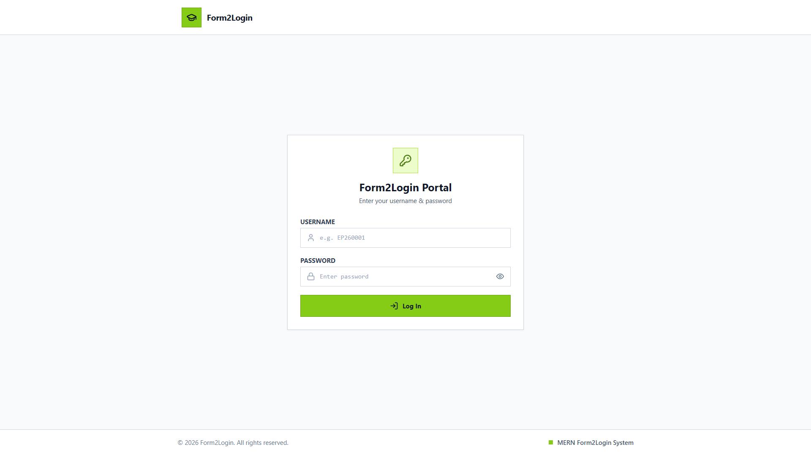
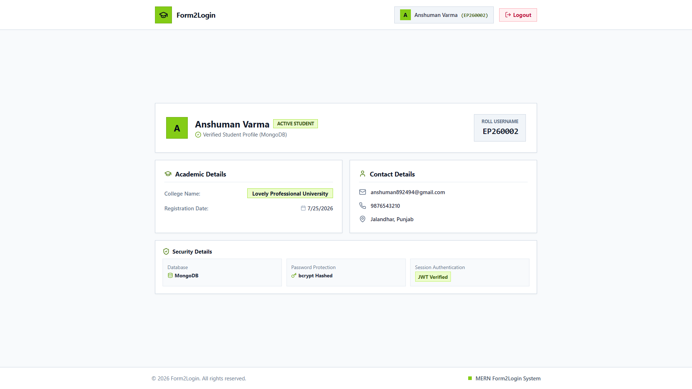

# Form2Login - Student Portal

A complete MERN Stack application that automatically processes **Google Form submissions**, generates unique student usernames & passwords, stores them securely in **MongoDB**, and sends welcome emails via **Google Apps Script**. Students can then log in to their personalized dashboard.

### 🔗 Live Links
- **Google Form (Registration):** [https://forms.gle/9miNRNo47GFkbPGZA](https://forms.gle/9miNRNo47GFkbPGZA)
- **Live Student Portal:** [https://form2login-server.onrender.com](https://form2login-server.onrender.com)

---

## 📸 Screenshots

### Login Page


### Student Dashboard


---

## 🚀 Quick Start (Local Development)

### 1. Install Dependencies
```bash
npm run setup
```

### 2. Environment Variables (`server/.env`)
Create a `.env` file inside the `server/` directory:
```env
PORT=5000
MONGO_URI=your_mongodb_connection_string
JWT_SECRET=your_jwt_secret
CLIENT_URL=http://localhost:3000
WEBHOOK_SECRET=your_secret_key_here
NODE_ENV=development
```

### 3. Run the App
```bash
npm run dev
```
- **Frontend**: http://localhost:3000
- **Backend**: http://localhost:5000

---

## 🔒 Security Features
- **Passwords** are securely hashed using `bcryptjs`.
- **JWT Authentication** is used for secure dashboard access.
- **Webhook Secret Key** protects the registration API from unauthorized access.
